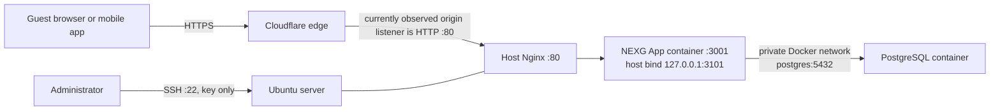

# NEXG App production security and cleanup runbook

- **Prepared:** 2026-09-23; Cloudflare dashboard and Phase 1 progress updated 2026-09-24
- **Target:** `https://nexgapp.com` and its Ubuntu/Docker origin
- **Status:** The owner completed the database backup and app-to-PostgreSQL recovery in Phase 1. Later security phases remain outstanding; this is not a forensic report or a certification.
- **Owner:** NEXG site owner; execute one phase at a time and record the result below.

This is the practical plan to secure the live site before starting the next product work. It separates facts observed during a bounded, read-only review from settings that must be checked in the hosting and Cloudflare dashboards. The local `security-audit` guidance and Cloudflare's official Agent Skill informed the review. It is not a forensic investigation or a guarantee that an account has never been accessed.

The 2026-09-23 server observations below are a timestamped snapshot, not current status. The
owner subsequently fixed the app's database connection on 2026-09-24; see Phase 1.2 and the
change log for the observed result and remaining verification items.

The local source patch now removes the fallback catalogue and returns HTTP 503 when
PostgreSQL cannot answer. It has not been deployed. Until the owner approves and completes a
release, production still runs the last deployed behavior described in the dated observations.

## 1. What the snapshot says

### Confirmed on 2026-09-23

- The site answers through Cloudflare and returned HTTP 200. The public response included security headers including CSP, HSTS, `X-Content-Type-Options`, `X-Frame-Options`, referrer policy, Permissions Policy, COOP, and CORP.
- The host is Ubuntu 24.04.4. The NEXG App runs in Docker. Host Nginx listens publicly on port 80. SSH listens publicly on port 22. No process was listening on host port 443 at the time of the socket check.
- The app is bound to `127.0.0.1:3101`; PostgreSQL is bound to `127.0.0.1:5433`. Neither app nor PostgreSQL was bound to a public interface. PostgreSQL's container port is 5432 on the private Compose network.
- The firewall is active with default-deny inbound. It allows ports 22, 80, and 443 from any address. Fail2ban's SSH jail was active. Password and keyboard-interactive SSH authentication were disabled; key authentication was enabled.
- PostgreSQL itself was healthy and had **21 categories, 128 subcategories, 640 merchants, and 6,000 items**. Do not reseed, recreate, or delete its volume to fix the app connection.
- The app's database login failed. The public `/api/health` response nevertheless said `status: "ok"`, reported `source: "seeded_json_fallback"`, `postgresConnected: false`, included a database authentication error, and reported the smaller fallback catalogue (120 merchants / 3,300 items). The database password is not included in that error.
- A public GET to `/api/metrics` and `/api/traces` is not protected by application authentication in the current route setup. Rate limiting is not the same as access control.
- The live host had only the NEXG App project directory. There was no old NEXG/Laravel app or old database container on that host. The Docker builder cache had about 2.185 GB reclaimable, but the root disk was only about 4% used. There is no urgent space cleanup.
- SSH logs reviewed for the last seven days showed successful key logins using the one key matching the local `nexg_deploy` public key. This limited log review did not establish whether every source IP was yours and does not prove that no earlier access occurred. IPs seen in the review included `196.96.116.14`, `41.81.242.139`, and the audit connection `105.161.142.19`; recognize them before deciding whether to rotate keys or investigate further.

### Verify in your accounts before changing anything

- Account members, API tokens, and the security event log were not reviewed. The Cloudflare SSL/TLS, DNS, and WAF findings from the browser review are recorded in the 2026-09-24 snapshot below; recheck before making changes.
- The server had no host listener on 443 in the 2026-09-23 socket snapshot. Cloudflare showed Flexible mode on 2026-09-24, so the visitor-to-edge leg is HTTPS while the observed edge-to-origin leg is HTTP. Use Full (strict) only after the origin has a valid certificate and accepts HTTPS on port 443.
- The presence of normal SSH probes or Fail2ban bans is not, by itself, evidence of a successful break-in. The bounded review did not find a successful login with a different key, but this is not a complete incident-response review.
- No database password, private SSH key, Cloudflare token, or other secret was read into this report.

### Cloudflare dashboard read-only snapshot — 2026-09-24

The signed-in Cloudflare dashboard for `nexgapp.com` was reviewed without changing settings:

- Zone plan shown: **Free**.
- SSL/TLS mode: **Flexible**. Dashboard says automatic mode is enabled. This means the public visitor-to-Cloudflare leg is HTTPS, while Cloudflare-to-origin is HTTP. It does not mean the origin certificate is installed or in use.
- Edge Certificates shows an **Active Universal SSL** certificate for `nexgapp.com` and `*.nexgapp.com`, plus a backup certificate marked issued. That is the browser-facing certificate.
- Origin Server → Origin Certificates lists **two** Cloudflare Origin CA certificates for `nexgapp.com` and `*.nexgapp.com`, expiring **Sep 19, 2041**. This confirms Cloudflare issued certificates; it does not show whether either matching certificate/private key was safely installed on the server or whether Nginx serves one.
- DNS shows the apex (`@`) and `www` A records proxied to the origin. Mail delivery, SPF/DKIM/DMARC and domain verification records are DNS-only, which is normal for those service records. Do not proxy mail or verification records as part of web hardening.
- The Security Overview says **No scans yet**. It has not run an on-demand security scan from this zone view.
- Security rules lists **0/5 custom rules**, **0/1 rate-limiting rules**, and **no managed rules created**. The zone is on the Free plan. The Security Overview at the same time labels “Web app exploits” as “All running,” and Security settings shows Cloudflare-managed-rules entries with confusing “Disabled: Always active” labels. The visible screens do not agree clearly about managed WAF rule deployment. Treat managed WAF coverage as **unverified** until the Managed Rules view or Cloudflare confirms which ruleset is active for this plan.
- The Security settings view explicitly showed Cloudflare HTTP DDoS protection as always active, and the DDoS protection page showed network-layer and SSL/TLS protections active. Browser Integrity Check and Replace Insecure JavaScript Libraries were enabled. Bot Fight Mode was off. No Cloudflare rate-limit rules were listed; the application has its own code-level rate limits, which are separate.

The dashboard account is authenticated in the user's browser. Only page values needed for this review were read. No certificate material, private key, token, DNS edits, rule edits, scans, or other settings were submitted.

## 2. Current request and data path



**Target state:** browser/mobile → Cloudflare HTTPS → Nginx HTTPS on origin port 443 with a verified certificate → app on loopback/private Compose network → PostgreSQL only on the Compose network. SSH remains a separate, controlled administration path.

## 3. Exposure map

| Service | Observed host binding | Internet-reachable now? | Target |
| --- | --- | --- | --- |
| SSH | `0.0.0.0:22`, `[::]:22` | Yes; key-only in observed config | Restrict to a trusted admin route/IP where practical; keep a recovery route and test a replacement key before removing the current one. |
| Host Nginx / HTTP | `0.0.0.0:80`, `[::]:80` | Yes; can bypass Cloudflare if someone connects directly to the origin IP | Keep web access available during migration; then allow only Cloudflare source ranges at the origin firewall/provider firewall. |
| Origin HTTPS | No host listener on `:443` observed | No origin listener observed | Configure and validate origin TLS before switching Cloudflare to Full (strict). |
| App | `127.0.0.1:3101` | No direct public bind observed | Keep loopback/private. Do not publish to `0.0.0.0`. |
| PostgreSQL | `127.0.0.1:5433` | No direct public bind observed | Prefer removing the host port mapping in production; app connects over private Compose DNS (`postgres:5432`). Never open 5432/5433 publicly. |

Port 80 is a normal HTTP web port, but an open listener means the origin can be contacted directly. Cloudflare protections apply to requests that pass through Cloudflare; they cannot protect a direct-to-origin request unless the origin firewall restricts it.

## 4. Priorities and completion criteria

| Priority | Finding | Required outcome |
| --- | --- | --- |
| P0 | App cannot authenticate to PostgreSQL and silently serves fallback data | Live DB connection was restored by the owner; the local source patch removes fallback behavior and returns 503 on DB failure. Release and post-release verification are pending owner approval. No volume or seed reset. |
| P0 | Health endpoint reports healthy while DB is disconnected and leaks raw DB error | Local source now queries PostgreSQL for readiness and returns a minimal 503 body on failure. Release and public verification remain pending. |
| P1 | Cloudflare-origin TLS is not proven and no origin 443 listener was observed | Valid origin HTTPS works; Cloudflare is set to Full (strict); redirect behavior is verified. |
| P1 | `/api/metrics` and `/api/traces` are publicly readable | Require authorized operator access at the app or a correctly scoped Cloudflare Access policy; verify anonymous requests are denied. |
| P1 | SSH is reachable from the entire internet | Confirm all accepted keys and login IPs; rotate safely if needed; restrict the path without losing recovery access. |
| P1 | Public origin HTTP can bypass Cloudflare controls | After Cloudflare routing and TLS are verified, restrict origin web ports to Cloudflare IP ranges or use a suitable Cloudflare Tunnel design. |
| P2 | Public health/version, telemetry, and lead routes reveal information or invite abuse | Minimize health/version output and retain appropriate endpoint-specific rate limits and server-side validation. |
| P2 | Backups, updates, alerting, and retention need owner-confirmed routine | Establish private encrypted backups, prove restoration, monitor security/app signals, and record update ownership. |

## 5. Phase 0 — prepare a safe change window

Do this before changing passwords, SSH keys, firewall rules, or TLS:

1. Sign in directly to your hosting provider and Cloudflare using accounts you control. Turn on strong MFA/passkeys, save recovery codes in your password manager, and remove only users or tokens you can positively identify as unneeded.
2. Keep one existing SSH session open for the whole maintenance window. Also confirm the hosting provider's web/serial console works. Do not close your working SSH session until a second, newly authenticated session succeeds.
3. Write down the server, domain, current Cloudflare SSL mode, DNS records, firewall rules, and the recognized SSH key fingerprints. Do not copy secret values into this repository, a chat, terminal transcript, ticket, or screenshot.
4. Confirm whether the SSH login source IPs listed above are yours or a trusted deployment location. If an IP is unfamiliar, preserve the relevant authentication logs and ask the hosting provider for an access review before deleting evidence or rebuilding the host.
5. Schedule a short maintenance window. Have the site open on a phone and desktop so you can check the guest experience immediately after TLS or edge-rule changes.

**Stop condition:** if you cannot reach the provider console or cannot identify a safe recovery path, do not change SSH or firewall rules yet.

## 6. Phase 1 — preserve the database, then fix the app connection

This phase repaired the live application-to-database credential mismatch without recreating PostgreSQL. The owner had already changed the database role password; the remaining fault was that Compose was still feeding the app a stale/default password. Docker's Postgres initialization variables do not change a password inside an already-initialized data directory. Do not rotate the role password again just to correct the app connection.

### 6.1 Make and check a database backup

Run these commands **in the server's Linux SSH shell**, from the live Compose project directory. Do not run them from Windows PowerShell. This makes a private custom-format PostgreSQL backup and checks that it can be read by `pg_restore`.

```bash
cd /var/www/apps/projects/nexg-concierge
set -euo pipefail
umask 077
mkdir -p /root/backups
backup="/root/backups/nexg-$(date +%F-%H%M%S).dump"
docker compose exec -T postgres pg_dump -U nexg_user -d nexg_db --format=custom > "$backup"
docker compose exec -T postgres pg_restore --list < "$backup" >/dev/null
sha256sum "$backup"
ls -lh "$backup"
```

Keep this backup private. Copy it to encrypted storage you control after the immediate change, and later perform a restore drill to a separate, non-production database. Do not paste the checksum or backup contents anywhere public. If the dump or `pg_restore --list` fails, stop and resolve the backup before changing the database role.

### 6.2 Reconcile the app URL with the existing password

The live recovery used a password containing punctuation, so the app needs a URI-encoded
copy while PostgreSQL receives the raw value. PostgreSQL requires percent-encoding for
reserved characters in connection URIs. Never paste the raw password into the URL or a
shell command.

1. In `/var/www/apps/projects/nexg-concierge/.env`, keep these two values derived from the
   **same existing database password**:
   - `POSTGRES_PASSWORD`: raw value for the Postgres container's initialization environment.
   - `POSTGRES_PASSWORD_URLENCODED`: percent-encoded value used in the app's connection URI.
   Generate the encoded value with a hidden-input tool such as Python's `getpass` and
   `urllib.parse.quote(secret, safe="")`. Write `.env` values using Compose-compatible
   single quoting so characters such as `$` and `#` remain literal. Keep the file at mode
   `600`, preserve `AUTH_SECRET` and other required settings, and remove any stale
   `DATABASE_URL` entry from the live Compose `.env`.
2. The base `docker-compose.yml` must use the private service host `postgres` and require
   `POSTGRES_PASSWORD_URLENCODED`; it must not insert raw `POSTGRES_PASSWORD` in the URI or
   fall back to a known development password. Validate quietly so resolved secrets are not
   printed:

   ```bash
   docker compose config -q
   ```

3. Recreate only the app container, then inspect both service states:

   ```bash
   docker compose up -d --no-deps app
   docker compose ps app postgres
   ```

   `--no-deps` avoids restarting PostgreSQL. Never run `docker compose down -v`, remove or
   prune the database volume, or run a seed script during credential recovery. Do not run
   plain `docker compose config` or share its output; it can contain resolved credentials.

### 6.3 Verify the real database is serving the site

On the server, inspect only the fields needed from the loopback health endpoint. This avoids
copying the raw database error or other unneeded response details into chat:

```bash
curl -fsS http://127.0.0.1:3101/api/health | python3 -c 'import json,sys; d=json.load(sys.stdin); print("status:",d.get("status")); print("source:",d.get("source")); print("postgresConnected:",d.get("postgresConnected")); print("merchants:",d.get("totalMerchants")); print("items:",d.get("totalItems"))'
```

Confirm both containers are healthy, `source` is `postgres`, `postgresConnected` is `True`,
and the catalogue reports 640 merchants and 6,000 items. Then independently check the public
storefront in a browser. An HTTP 503 or non-`ok` readiness result is a failure; inspect app
logs locally and redact secrets before sharing any excerpt.

**Pass:** database backup archive is readable; PostgreSQL remains healthy and on its existing
volume; app reports PostgreSQL connected; 640 merchants / 6,000 items remain; storefront
loads. A full restore drill and encrypted off-host copy are separate outstanding items.

**Fail:** fallback source, failed DB connection, changed counts, or a restarted/unhealthy database. Keep the old SSH session and backup; do not seed or delete anything to make the error disappear.

## 7. Phase 2 — close API information leaks and protect operator routes

The catalog/search endpoints (`/api/categories`, `/api/merchants`, `/api/merchants/:id`, `/api/search`, and `/api/areas`) are intended for guest discovery and can remain public with validation and rate limits. Authentication endpoints are public entry points by design; protect them with abuse controls. Do not put PostgreSQL credentials in the website bundle, Expo app, browser storage, or API responses.

The following require an application release after code changes:

1. **Health/readiness:** make the public response minimal and non-sensitive. It must not include `postgresError`, SQL text, connection URLs, passwords, stack traces, process environment, or detailed internal configuration. The current response says `status: "ok"` even when DB authentication failed. Define a minimal liveness check separately from a readiness check that is true only when the required database is connected; readiness may return 503 without disclosing the underlying error. Update container and uptime probes to use the intended check so liveness and readiness are not accidentally conflated.
2. **Metrics and traces:** require authenticated staff/operator access. Current source has no user role field and stores users in an in-process map, so simply adding the existing `requireAuth` middleware would allow any signed-up customer and would not provide durable operator authorization. Recommended first implementation: a narrowly scoped Cloudflare Access policy for `/api/metrics` and `/api/traces`, with the allowed operator identity; validate the signed `Cf-Access-Jwt-Assertion` at the origin (or use a Cloudflare Tunnel configured to validate Access tokens) so direct-origin traffic cannot forge an Access header. Keep the public storefront and customer/mobile API outside this Access policy. Confirm anonymous and non-operator requests are denied after deployment. If app-native operator roles are chosen instead, first build and migrate durable role storage and seed the initial operator safely.
3. **Version/build information:** decide whether public `/api/version` is needed. If kept, return only a minimal release identifier; never return secrets, filesystem paths, environment variables, or detailed dependency inventory.
4. **Telemetry and lead capture:** retain body validation, length limits, per-route rate limits, spam controls, and privacy-conscious logging. Never log passwords, bearer tokens, full payment data, or unrestricted personal data.
5. **Future merchant portals:** every write must authenticate the account, verify role and merchant/tenant ownership on the server, validate state transitions, and log the actor. A merchant ID supplied by a browser is not proof of authorization. Add tests for cross-merchant access before portal release.

The app's local `docs/SECURITY.md` describes current headers and in-memory rate limits. Its current rate limiting does not make public metrics/traces private, and in-memory limits do not coordinate across multiple app instances. Keep the current single-instance limit behavior documented until a shared store is deliberately designed.

**Implementation owner:** code change/release after the owner has completed the production recovery steps in this runbook. Do not edit production files over SSH as a substitute for a reviewed source change.

## 8. Phase 3 — secure Cloudflare account, DNS, and origin TLS

### 8.1 Account and DNS baseline

In Cloudflare, confirm:

- You control the account and zone; unknown members and API tokens are removed or rotated after checking what uses them.
- MFA/passkey is enabled and recovery codes are stored privately. Use scoped API tokens rather than a Global API Key; grant only the zone/account permissions the automation needs.
- The public web `A`/`AAAA` DNS records point to the intended origin and are proxied through Cloudflare. Keep mail and verification records DNS-only where required by their service; do not proxy arbitrary records just to make them orange-cloud.
- Review DNSSEC at the registrar and Cloudflare before enabling/changing it, to avoid a mismatch that makes the domain disappear.
- Note the current SSL/TLS mode and edge certificate status before making changes.

At the 2026-09-24 dashboard review, the mode was Flexible, Universal SSL was Active for apex and wildcard, two matching Origin CA certificates were listed, and `@` / `www` were proxied. Use those as the recorded starting state, then recheck them immediately before the maintenance change in case they have changed.

### 8.2 Install and test origin HTTPS before switching modes

The origin snapshot had no listener on 443, so do not switch to Full (strict) yet. First configure Nginx to serve `nexgapp.com` over HTTPS on 443 and proxy to the app's loopback port. Choose one:

- A publicly trusted certificate (for example, Let's Encrypt), including renewal monitoring; or
- A Cloudflare Origin CA certificate if the origin will only be accessed through Cloudflare. Origin CA certificates are trusted by Cloudflare for origin connections, not by a browser connecting directly to the origin.

The prior handoff records that a previous Origin CA creation attempt failed because the account did not have permission to the zone. Check whether that access issue still exists. If it does, ask the zone owner to issue the certificate or grant the minimum SSL/TLS permission needed; otherwise use the publicly trusted certificate route.

Before changing the Cloudflare mode, confirm on the server that Nginx config validates, port 443 is listening, the certificate is unexpired and covers the hostname, and a request through Cloudflare succeeds. Keep HTTP redirect behavior consistent with the chosen origin mode; Flexible plus an origin HTTPS redirect can loop.

Then set **SSL/TLS → Overview → Full (strict)**. Verify the browser, API, and mobile client all work over HTTPS; check for redirect loops, mixed content, Cloudflare 526 errors, and authentication/session behavior. Keep a rollback note with the prior mode and restore only long enough to repair origin TLS if needed; do not leave Flexible as the end state for a site handling logins or personalized data.

Keep `Always Use HTTPS` enabled at the edge after checking redirect behavior. The app already emits HSTS in production; retain it only while HTTPS is reliable for the hostname and all included subdomains. HSTS can make a bad HTTPS change persist in browsers.

## 9. Phase 4 — put Cloudflare in front of the origin and tune protections

### 9.1 Stop direct-to-origin web bypass

Once Cloudflare proxying and origin TLS are confirmed:

1. At the hosting provider firewall (preferred) or carefully managed host firewall, allow inbound 80/443 only from Cloudflare's current published IPv4 and IPv6 ranges. Use Cloudflare's official IP list and a process to keep it current; do not copy an old list from a blog or hard-code one address.
2. Keep SSH rules separate from web rules. Preserve the current admin source/recovery path until the new SSH access method is tested. Do not bulk-replace firewall rules or deny port 22 from your only session.
3. Check access to the site through the domain and from a mobile network. A direct request to the origin IP should no longer serve the app to arbitrary internet clients.
4. Confirm ports 5432 and 5433 remain closed publicly and the app remains loopback/private. The production Compose file should not publish PostgreSQL's host port if it is not needed for local administration.

If reliable IP allowlisting is impractical, consider Cloudflare Tunnel for the web origin as a planned deployment change. Treat it as a designed migration with a rollback, not an ad hoc package install during a firewall change.

### 9.2 WAF and abusive traffic controls

- Review **Security → Events** before and after each rule change. Save a baseline and note any false positives.
- Deploy the Cloudflare Free Managed Ruleset if available on the zone. Current Cloudflare documentation lists it on all plans. The broader Cloudflare Managed Ruleset and OWASP Core Ruleset are plan-dependent (currently Pro or higher in Cloudflare's plan table); use only what the dashboard offers and what your plan supports.
- Start with the vendor defaults and narrowly scoped exceptions for demonstrated false positives. Do not globally disable a ruleset because one API request was blocked.
- Add endpoint-specific rate controls for login/signup/refresh and lead capture where available on your plan. Tune from observed legitimate traffic. Keep the app's own rate limits as another layer.
- Do **not** add an interactive challenge to every `/api/*` request. That can break native mobile apps and legitimate API calls. For a suspected bot problem, target the affected routes, test guest browse/login/signup on mobile, and verify event logs before tightening the rule.
- Turnstile can be considered for signup/lead flows only if abuse warrants it; the server must validate the token. A widget in the browser alone is not protection.
- API Shield/schema validation and API discovery are optional follow-up controls. Check plan availability and compatibility with actual request/response schemas first; do not make launch depend on a paid feature.

## 10. Phase 5 — rotate SSH keys without locking yourself out

The current observed setup was key-only, but the server accepted one root key and the `deployer` account had sudo and Docker access. Membership in the Docker group is effectively root-level access. The user should verify whether every successful login and key is recognized.

### Safe rotation sequence

1. Keep the current SSH session and provider console open. Record the current and replacement public-key fingerprints. On Windows PowerShell, the existing public key fingerprint can be viewed with:

   ```powershell
   ssh-keygen -lf "$env:USERPROFILE\.ssh\nexg_deploy.pub"
   ```

   Before removing any key, inventory all server-side key locations and effective SSH settings from the open server session. The observed snapshot found one key under root and none under `deployer`, but confirm the current state:

   ```bash
   sudo sshd -T | grep -Ei 'authorizedkeys(file|command)|permitrootlogin|passwordauthentication|pubkeyauthentication|kbdinteractiveauthentication'
   sudo find /root /home -type f -name authorized_keys -print
   ```

   For every listed file, compare its public-key lines/fingerprints privately against the keys you recognize. Also review any `AuthorizedKeysCommand` shown by `sshd -T`. Do not paste private or public key lines into this document or a chat; fingerprints and owners are enough to track them.

2. If rotation is warranted, generate a new key on your own Windows account. Protect it with a strong passphrase and never upload or paste the private key:

   ```powershell
   ssh-keygen -t ed25519 -a 64 -f "$env:USERPROFILE\.ssh\nexg_deploy_rotation_2026-09-23" -C "NEXG deploy 2026-09-23"
   ssh-keygen -lf "$env:USERPROFILE\.ssh\nexg_deploy_rotation_2026-09-23.pub"
   ```

3. Append the **single line** from the new `.pub` file to `/root/.ssh/authorized_keys` using the provider console or the already-authenticated SSH session. Set the file permissions to 600 and verify the replacement fingerprint appears. Do not replace the whole file.
4. Open a second terminal and authenticate using the new key explicitly:

   ```powershell
   ssh -i "$env:USERPROFILE\.ssh\nexg_deploy_rotation_2026-09-23" root@212.95.32.229
   ```

   Confirm the host identity, expected account, and ability to administer the app. Only after this succeeds should you remove the old public-key line by matching its fingerprint. Leave the new session open while confirming the old key no longer authenticates.
5. Prefer a named, non-root admin identity for future routine work after it has been provisioned and tested. Do not disable root login until that user can perform necessary recovery. If the named user remains in `docker` or unrestricted sudo, it still has root-equivalent power; decide the least-privilege model deliberately.
6. Restrict SSH at the provider firewall to a stable admin IP/VPN if available. If your home/mobile IP changes, use a safer admin network or Cloudflare Tunnel/Access design rather than risking lockout. Keep public SSH key-only with fail2ban and security updates in the meantime.

If you believe the current key was stolen or shared, treat that as an incident: preserve relevant logs, rotate it using the add-test-remove order above, rotate any deployment/Cloudflare/provider credentials accessible with that key, and review the provider audit log. Do not simply truncate `authorized_keys` or disable SSH.

## 11. Phase 6 — clean the host safely and establish maintenance

### What to preserve

- Preserve the existing `nexg-concierge-pgdata` volume and its 640 / 6,000 catalogue. It contains the live data.
- Preserve private backups, the current working access key until replacement login is proven, and the SSH/authentication logs needed for an investigation.
- The prior inventory found no old NEXG/Laravel app on this server. Old project backups were recorded as local files, not live server directories; do not delete your local archive until you have independently checked its contents and retention need.

### What can be cleaned later

- There was no disk pressure. The ~2.185 GB reclaimable Docker builder cache is optional housekeeping, not a security emergency. If you want that space later, inspect with `docker system df` and remove only unused builder cache during a quiet window. Builds may be slower afterward.
- Review old Docker images/containers and `/root/backups` by date/ownership before deleting. Keep at least one recent known-good backup plus an encrypted off-host copy and a retention record.
- Never run `docker system prune --volumes`, `docker volume prune`, `docker compose down -v`, or broad recursive deletion as a “cleanup.” These can permanently delete the live database or recovery data.
- Do not remove packages or system accounts just because they look unfamiliar. Identify the service, owner, and dependency first.

### Maintenance baseline

- Apply Ubuntu, Docker, Nginx, and application security updates on a documented schedule. Review changes and restart services in a maintenance window; verify the storefront and database afterward.
- Configure Docker log rotation and retention so logs cannot fill the root disk. Avoid logging request bodies or secrets.
- Keep daily database backups encrypted and off-host, alert on failed backups, and periodically restore to a separate test database. A backup that has never been restored is unproven.
- Monitor failed/successful SSH logins, Fail2ban activity, app errors, database readiness, disk use, TLS expiry/renewal, and Cloudflare security events. Ensure alerts go to a channel you actively check.
- Keep a change log with who changed what, when, why, before/after state, backup reference, verification result, and rollback action.

## 12. Final acceptance gate — complete this before resuming product work

Mark each item only after you have personally observed it:

- [ ] Cloudflare and hosting accounts have MFA; unknown members/tokens reviewed; recovery codes safely stored.
- [ ] Database backup is readable, stored privately, and an off-host copy exists.
- [ ] Existing PostgreSQL volume is intact and the app connects to it; 21 / 128 / 640 / 6,000 counts are confirmed.
- [ ] `/api/health` no longer says healthy with a disconnected DB and does not leak a raw database error or internal details.
- [ ] Anonymous requests to `/api/metrics` and `/api/traces` are denied; authorized operations access still works.
- [ ] Origin port 443 serves a valid certificate for `nexgapp.com`; Cloudflare SSL/TLS mode is Full (strict); browser and mobile HTTPS work.
- [ ] Direct origin web traffic is blocked or intentionally controlled; ports 5432/5433 are not public; app and DB remain private.
- [ ] Every SSH key and successful login is recognized; if rotated, the new key was tested before the old key was removed; provider recovery is available.
- [ ] Cloudflare WAF/rate rules have been checked against real guest discovery, signup, login, and mobile API flows.
- [ ] Backup restore procedure, log retention, security updates, and alert ownership are written down.
- [ ] Change log below has an entry for every production change.

If any item fails, record it and pause subsequent work at the affected phase. Do not use a successful homepage load as proof that the database, origin TLS, or operator endpoints are secure.

## 13. Change and verification log

| Date/time (Africa/Nairobi) | Phase/action | Operator | Backup or change reference | Before → after | Verification result / rollback |
| --- | --- | --- | --- | --- | --- |
| 2026-09-24 (server file time 07:48; timezone unverified) | Phase 1.1: create and validate database backup | Owner via SSH | `/root/backups/nexg-2026-09-24-074642.dump` (146K) | No newly verified backup → private root-owned archive, mode 600 | `pg_restore --list` succeeded; full restore and off-host copy not yet verified. No DB password or app service changed. |
| 2026-09-24 (server timestamp 09:20 for config backups; timezone unverified) | Phase 1.2: sync Compose app URL with existing DB password and verify live connection | Owner via SSH | DB dump above; `/root/backups/nexg-compose-2026-09-24-092002.yml`; `/root/backups/nexg-env-2026-09-24-092002.env` (owner reported protected copies created with mode 600) | App had `source=seeded_json_fallback`, `postgresConnected=false`, 120 merchants / 3,300 items → app now uses PostgreSQL, connected, 640 merchants / 6,000 items | `docker compose config -q` returned silently; only `app` was recreated; both services reported healthy; PostgreSQL remained up for 35 hours and bound to loopback. Repository source/docs now mirror the change but are uncommitted. Local PowerShell syntax parse passed; this workstation lacks Docker CLI, so no second local Compose validation. Public storefront check, full restore drill, and encrypted off-host backup remain outstanding. No password value recorded. |
| 2026-09-24 (local source change; not deployed) | Remove JSON catalogue fallback; make readiness and guest catalogue fail closed on database errors | Agent prepared; owner release approval required | Local source diff; see `CHANGELOG.md` Unreleased | Local app behavior changed from fallback serving to PostgreSQL-only reads and 503 errors | TypeScript check and diff whitespace check passed. Full tests/build and database-outage simulation not run. No production container restarted; live status remains the owner's last reported DB connection success. |
|  |  |  |  |  |  |
|  |  |  |  |  |  |

## 14. Sources and repository references

The Cloudflare recommendations were prepared using Cloudflare's official Agent Skill, which directs the operator to the product-specific Cloudflare documentation and to verify current product behavior. The skill was read from the official upstream repository; it is not claimed to be installed locally.

- [Cloudflare official Agent Skill](https://raw.githubusercontent.com/cloudflare/skills/main/skills/cloudflare/SKILL.md)
- [Cloudflare Flexible mode](https://developers.cloudflare.com/ssl/origin-configuration/ssl-modes/flexible/) — visitor-to-edge HTTPS does not encrypt the edge-to-origin connection.
- [Cloudflare Full (strict)](https://developers.cloudflare.com/ssl/origin-configuration/ssl-modes/full-strict/) — requires origin HTTPS on port 443 and a valid hostname-matching certificate.
- [Cloudflare Origin CA](https://developers.cloudflare.com/ssl/origin-configuration/origin-ca/)
- [Cloudflare managed WAF rules and plan availability](https://developers.cloudflare.com/waf/managed-rules/)
- [Cloudflare Access application paths](https://developers.cloudflare.com/cloudflare-one/access-controls/policies/app-paths/)
- [Cloudflare IP ranges](https://www.cloudflare.com/ips/)
- [Docker Official Image for PostgreSQL](https://github.com/docker-library/docs/blob/master/postgres/content.md) — initialization variables only apply to an empty data directory; existing databases are left untouched on container startup.
- [PostgreSQL connection URI documentation](https://www.postgresql.org/docs/16/libpq-connect.html)
- Repository implementation references: [`server/index.ts`](../server/index.ts), [`server/security.ts`](../server/security.ts), [`server/observability.ts`](../server/observability.ts), [`docker-compose.yml`](../docker-compose.yml), and [`docs/SECURITY.md`](./SECURITY.md).

---

**Next handoff:** after the owner completes and records this security gate, resume the NEXG App product plan. The first code follow-up should implement the health/readiness correction and protect operator observability endpoints, then verify the public guest journey and mobile API before any portal work.
